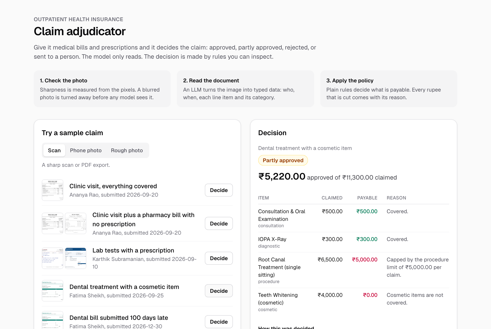

# Claim adjudicator

Decides outpatient health insurance claims from photos of medical bills and prescriptions. It answers approved, partly approved, rejected, sent to a person, or "take a clearer photo", and gives a reason for every rupee it cuts.

**Live demo: https://claim-adjudicator.onrender.com** (free hosting that sleeps when idle, so the first load can take up to a minute)



## How it works

A claim goes through three steps, and each one can stop it.

1. **Check the photo.** Sharpness is measured from the pixels. A blurred photo is turned away before any model is called.
2. **Read the document.** An LLM (Gemini) turns each image into typed data: provider, patient, doctor, date, every line item and its category. The answer has to fit a Pydantic schema or it is rejected.
3. **Apply the policy.** Plain Python rules decide what is payable. There is no LLM in this step.

The split is deliberate. The model only reads; it never decides whether to pay. So text printed on a bill cannot talk the system into an approval, the same documents always give the same decision, and every decision can be traced to a rule.

### The rules, in order

| Step | What is checked | If it fails |
|---|---|---|
| Documents | Patient is the member, dates are readable, items add up to the total | Manual review |
| Dates | Bill is inside the policy period and submitted within 30 days | That bill is not payable |
| Coverage | The item's category is covered (cosmetic and miscellaneous charges are not) | That item is not payable |
| Prescription | A stand-alone pharmacy or lab bill has a prescription for the same patient dated on or before it | Those items are not payable |
| Limits | Each category has a cap per claim; a bill-level discount is shared across its items | Capped |
| Payout | 10% co-pay, then whatever is left of the annual limit | Reduced |

The policy numbers live in [`backend/policies/standard_opd.json`](backend/policies/standard_opd.json). They are invented to resemble a typical OPD cover.

## Results

Measured on a generated test set of 53 documents and 40 claims, each rendered three ways: a clean scan, an ordinary phone photo, and a rough photo (angled, dim, blurred, low resolution). Model: `gemini-3.5-flash-lite`, one run.

| | Clean scan | Phone photo | Rough photo |
|---|---|---|---|
| Fields read correctly | 477/477 | 477/477 | 441/477 (92.5%) |
| Line items read correctly | 160/160 | 160/160 | 134/160 (83.8%) |
| Documents with no mistake | 53/53 | 53/53 | 36/53 (67.9%) |
| **Claims, model alone:** correct | 40 | 40 | 31 |
| sent to manual review by the rules | 0 | 0 | 6 |
| wrongly rejected | 0 | 0 | 3 |
| overpaid | 0 | 0 | 0 |
| **Claims, whole system:** correct | 40 | 40 | 0 |
| clearer photo requested | 0 | 0 | 40 |

### What the evaluation showed

- **Scans and ordinary photos were read without a single mistake.** That includes seven date formats, stamps over the page, handwritten totals, and three bills carrying text that tells the model to report a total of 99999.
- **On rough photos the model guesses instead of refusing.** It returned an invented patient name, product names that were not on the page, and the year 2024 where the page said 2026.
- **The rules caught 6 of the 9 wrong claims,** because the amounts no longer added up or the name did not match. The other 3 were valid claims wrongly rejected: a misread year put the bill outside the policy period. No claim was overpaid.
- **The model cannot judge its own reading.** I added a required field asking it to say "poor" if it had to guess any character. On 13 test images it answered "clear" every time, including for images with ten or more mistakes. That change was dropped.
- **Measuring sharpness directly works.** Variance of the Laplacian, at a standard width: scans score at least 1478, ordinary photos at least 524, rough photos at most 36. With the threshold at 150, every rough photo is turned away and the model is never called on it.

### Limits

- The sharpness check is blunt. It stops all 53 rough images: the 17 the model misread and also the 36 it read correctly.
- The threshold sits in a wide empty gap (36 to 524). No test image falls in between, so 150 is a placeholder until intermediate blur levels are tested.
- The documents are synthetic. Real phone photos will differ in ways CSS effects do not capture.
- One model and one run. LLM output varies between runs.
- Not handled: the same bill submitted in two claims, waiting periods, pre-existing conditions, multi-page documents and PDFs.

## Run it

You need Python 3.11+, Node 20+, and a free Gemini API key from [Google AI Studio](https://aistudio.google.com/apikey).

Backend:

```bash
cd backend
python3 -m venv .venv
.venv/bin/pip install -r requirements-dev.txt
cp .env.example .env        # then paste your key into .env
.venv/bin/uvicorn app.api:app --port 8000
```

Frontend, in a second terminal:

```bash
cd frontend
npm install
npm run dev
```

Open http://localhost:3000 and pick a sample claim. Switch the image quality to "Rough photo" to see the sharpness check turn a claim away. The API has its own page at http://localhost:8000/docs.

Use made-up documents only. Images are sent to Gemini's free tier, which may keep them.

### Without the web app

```bash
cd backend
.venv/bin/python -m pytest                                                       # 66 tests, no API calls
.venv/bin/python -m app.adjudicate claims/claim_004_partial_limits.json --offline  # one claim, no API calls
.venv/bin/python -m app.adjudicate claims/claim_004_partial_limits.json            # the same claim, read by the model
.venv/bin/python -m app.evaluate                                                 # re-score the saved run, no API calls
```

To rebuild the test set and its images: `python -m scripts.generate_dataset`, `playwright install chromium`, then `python -m scripts.render_samples dataset`.

## Deploy

The [`Dockerfile`](Dockerfile) builds one image: the screen is compiled to static files and the Python backend serves both it and the API from a single address. [`render.yaml`](render.yaml) describes it as a free web service on [Render](https://render.com):

1. In the Render dashboard choose **New > Blueprint** and pick this repository.
2. Paste your Gemini API key when asked for `GEMINI_API_KEY`. It is stored by Render, not in the repository.
3. Wait for the first build, then open the address Render gives you.

A free service sleeps after 15 minutes without visitors, so the first visit after a quiet spell takes up to a minute to load.

To run the same image yourself:

```bash
docker build -t claim-adjudicator .
docker run -p 8000:8000 --env-file backend/.env claim-adjudicator
```

## Layout

```
backend/
  app/
    quality.py      step 1: sharpness check
    extract.py      step 2: image to typed data with Gemini
    schemas.py      the shape the model must answer in
    rules.py        step 3: the policy rules
    claims.py       shapes for policy, claim and decision
    adjudicate.py   the three steps joined together
    api.py          FastAPI endpoints
    evaluate.py     extraction and decision accuracy
  scripts/          test-set generator and image renderer
  samples/          five hand-made documents
  claims/           six sample claims with their expected decisions
  dataset/          53 generated documents and 40 claims
  results/          the model's saved answers and the scored summary
  tests/
frontend/           Next.js screen
Dockerfile          one image for the screen and the API
render.yaml         free deployment on Render
```

## Design choices worth knowing

- **Money is `Decimal`.** The model returns floats; they are converted at the boundary and all policy arithmetic is exact to the paisa.
- **Labels cannot be wrong.** Each test document is created as data first and then printed into HTML, so the expected answer and the page cannot disagree.
- **Wrong decisions are sorted by direction.** "Sent to a person" is a safe failure, "overpaid" is not. The evaluator reports them separately instead of one accuracy number.
- **Model answers are saved.** Scoring again, or changing how scoring works, costs no API calls and the published numbers can be reproduced.
